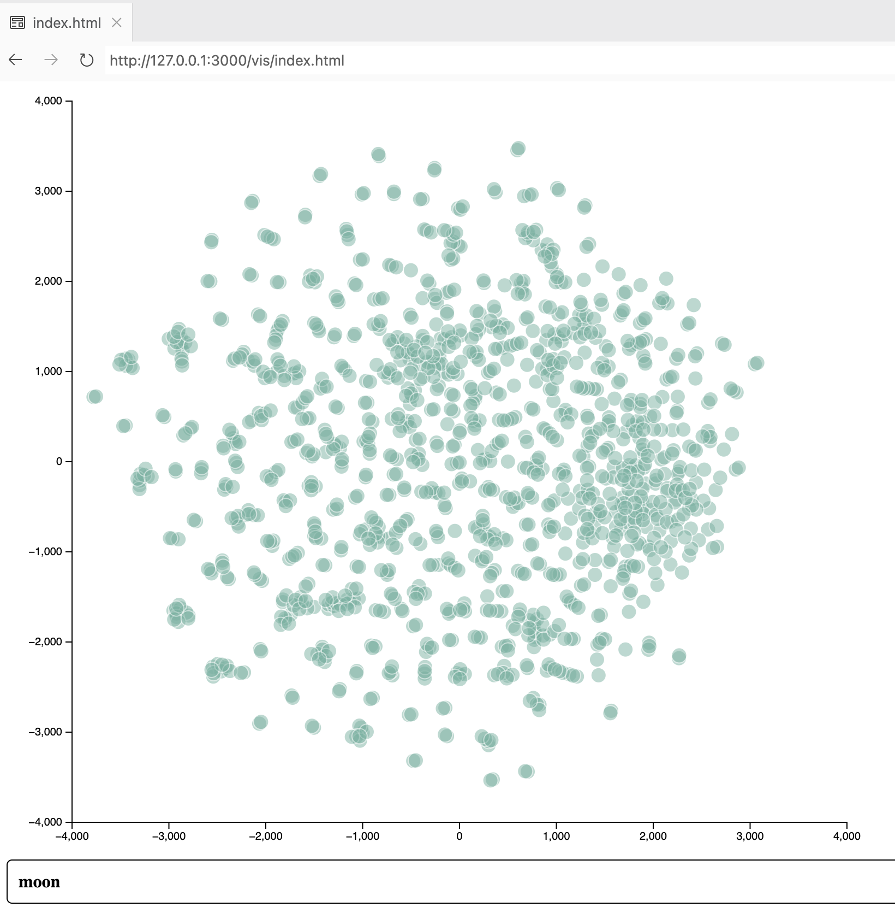

# word2vec2d3

This is a quick-n-dirty tool to process a [word2vec](https://github.com/asmaloney/word2vec) binary file using [t-SNE](https://lvdmaaten.github.io/tsne/) (t-Distributed Stochastic Neighbor Embedding) to produce a CSV file which [d3.js](https://d3js.org) can visualize using a scatterplot.



## Why?

I am a member of an independent learning group where we read about a topic and then hack some form of implementation. In the previous round when our theme was language models, I'd been playing around with word2vec to see how embeddings work. Our next theme was data visualization, so I thought I'd combine the two and try to visualize the word2vec data.

This takes the word2vec binary data and uses t-SNE to reduce the dimensions to 2 so we can plot them in a scatterplot.

## Building

To build the word2vec2d3 executable:

```
% go build
```

## Running

I hardcoded all the parameters in _main.go_, so you might want/need to change them there before building.

It assumes [word2vec](https://github.com/asmaloney/word2vec) is located in `../` and that the `vectors.bin` file has been generated using `word2vec/scripts/demo-word.sh`. If you want to use a differnt .bin file, you will need to change `inputFile` in _main.go_.

To run it:

```
% ./word2vec2d3
"../word2vec/data/vectors.bin" : 57704809 bytes
	71291 words; 200 dimensions
	(limiting to 1250 words)
t-SNE:
	perplexity = 5.000000
	learning rate = 300.000000
	iterations = 1500
Computing P-values for point 0 of 1249...
Computing P-values for point 500 of 1249...
Computing P-values for point 1000 of 1249...
 [0]: divergence = 5.116496591576434
 [10]: divergence = 5.3209596071602405
 [20]: divergence = 3.30119184795357
...
```

This will produce a file `data.csv` (you can change the name using `outputFile` in _main.go_).

## Viewing Using d3.js

Because it is loading a local file, the HTML file won't load properly in a browser.

I use VSCode with the [Live Preview](https://marketplace.visualstudio.com/items?itemName=ms-vscode.live-server) extension. This will load local files properly.

Simply open the _vis/index.html_ file in VSCode, right click in it, and choose **Preview File**.
